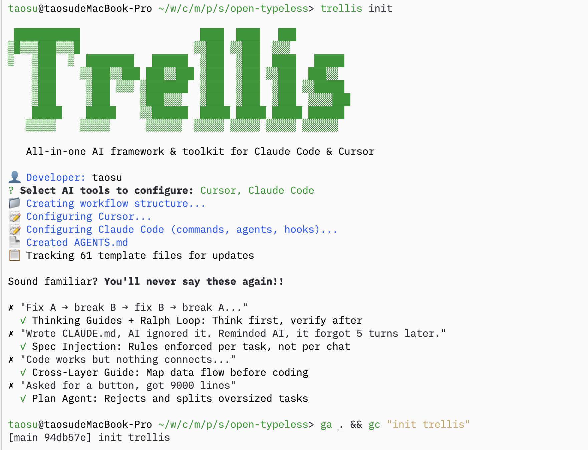

# 1. 项目初始化

```bash
npx create-electron-app@latest open-typeless --template=vite-typescript

cd open-typeless

# 删除 npm 生成的文件
rm -rf node_modules package-lock.json

# 创建 .npmrc (pnpm + Electron 必需)
cat > .npmrc << 'EOF'
node-linker=hoisted
shamefully-hoist=true
EOF

# 用 pnpm 重新安装
pnpm install
```

# 2. trellis 初始化

```bash
trellis init
```



# 3. 从旧项目 cp spec 到新项目

> 本项目顺便开源我们内部的 electron 的一些小实践,我本人是后端工程师,对于桌面端开发一窍不通,如有bug请谅解

```bash
cp -r ../old-project/electron-doc ./
```

# 4. 使唤 ai 填充本项目的 spec 

## prompt1

先 research下 typeless(https://www.typeless.com/) 这个产品是什么,有什么功能

## prompt2

然后我们项目是打算复刻typeless,做一个 open-typeless ,需求如下

```md
一个 **macOS 语音输入工具**,类似于 macOS 自带的听写功能,但使用火山引擎 (Volcengine) 的 ASR 服务来实现更好的中文识别效果。

---

### 核心功能

**按住说话,松开粘贴** - Push-to-Talk 模式

1. 按住 **Right Option (⌥)** 键 → 开始录音
2. 说话
3. 松开按键 → 自动将识别的文字粘贴到当前光标位置

或者使用 **蓝牙遥控器** (如自拍杆遥控器):
- 第一次按 → 开始录音
- 第二次按 → 停止并粘贴
- 双击 → 发送 Enter 键

---

### 技术架构

```
┌─────────────────────────────────────────────────────────────┐
│                      用户操作                                │
│  按住 Right Option / 蓝牙遥控器                              │
└─────────────────────┬───────────────────────────────────────┘
                      │
┌─────────────────────▼───────────────────────────────────────┐
│                  Main Process                                │
│  ┌─────────────┐  ┌─────────────┐  ┌──────────────────┐     │
│  │ uiohook-napi│  │  node-hid   │  │ Floating Window  │     │
│  │ 键盘监听     │  │ 蓝牙遥控器  │  │ 管理             │     │
│  └──────┬──────┘  └──────┬──────┘  └────────┬─────────┘     │
│         │                │                   │               │
│         └────────────────┴───────────────────┘               │
│                          │                                   │
│  ┌───────────────────────▼──────────────────────────────┐   │
│  │              Volcengine ASR Client                    │   │
│  │  WebSocket → wss://openspeech.bytedance.com          │   │
│  │  实时语音识别 (V3 BigModel API)                       │   │
│  └───────────────────────────────────────────────────────┘   │
└─────────────────────────────────────────────────────────────┘
                      │
┌─────────────────────▼───────────────────────────────────────┐
│                Floating Window (Renderer)                    │
│  ┌─────────────────────────────────────────────────────┐    │
│  │  ● Listening...                                      │    │
│  │  ─────────────────────────────────────────────────   │    │
│  │  你好世界|                                           │    │
│  └─────────────────────────────────────────────────────┘    │
│  - 显示录音状态                                              │
│  - 实时显示识别文字 (interim + final)                        │
└─────────────────────────────────────────────────────────────┘
                      │
┌─────────────────────▼───────────────────────────────────────┐
│           @xitanggg/node-insert-text                         │
│           直接插入文字到光标位置 (不污染剪贴板)               │
└─────────────────────────────────────────────────────────────┘
```

帮我创建一个对应的 task 来从 electron-doc/ 这个 spec 里面挑选有用的 spec 存放进本项目里的spec


## prompt3

开始

## prompt4

分批次帮我提交下代码

## prompt5 

/record-session